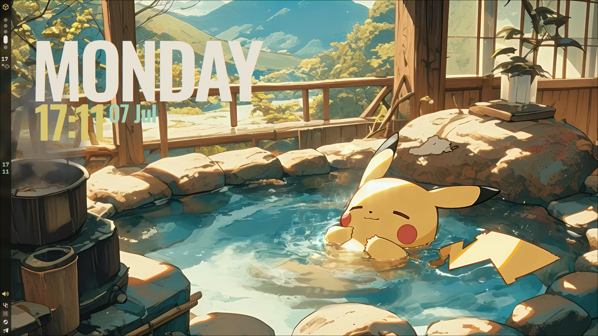

*ARTEMIDA shell*

*is a bad written shell* in quickshell inspired by [celestia-shell](https://github.com/Ayanashi/Celestia)

for installing clone repository into 
  .config/quickshell 
directory

and install quickshell

for Arch:

  - `yay -S quickshell-git`
  - `paru -S quickshell-git`

for another distribution idk

dependency

  - `hyprland`  window manager
  - `mpvpaper`  for live wallpaper
  - `matugen`   for colors (i know about built in color function in quickshell, but i prefer to use matugen)

*Preview*
***FULL DESKTOP***

***BAR PREWIEW***

